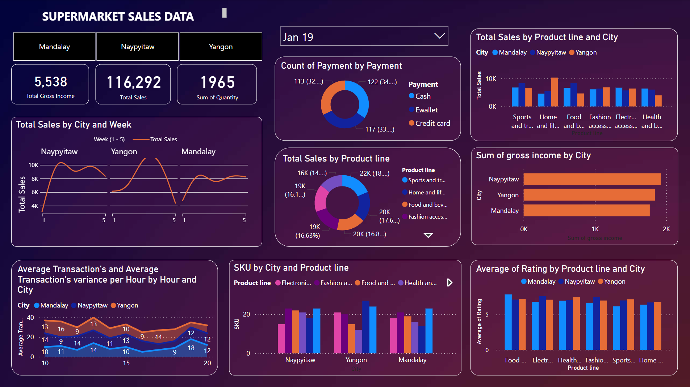

# Supermarket Sales Analysis Project

## Overview
This project analyzes supermarket sales data to uncover valuable insights using SQL and Power BI. SQL is employed for data extraction, transformation, and analysis, while Power BI is used to visualize the results and present key findings through interactive dashboards. The integration of SQL and Power BI ensures efficient data handling and insightful visualization.

## Files Included
1. **SQLQuery1.sql**
   - Contains SQL queries for:
     - Identifying the best-performing branches and product lines.
     - Analyzing customer purchasing behavior.
     - Determining the contribution of product lines to gross income.
     - Ranking product lines by performance across cities using window functions.

2. **Supermarket_sales.pbix**
   - A Power BI file with interactive visualizations and dashboards showcasing:
     - Sales trends over time.
     - Regional and category-wise performance metrics.
     - Customer type analysis and product line contributions.
     
     

## Why SQL, Power BI and Jupyter Notebook?
- **SQL**:
  - Handles large datasets efficiently with operations like grouping, filtering, and ranking.
  - Provides a robust foundation for extracting actionable insights directly from raw data.
  - Advanced features like window functions enable detailed analyses such as ranking product lines by city.

- **Power BI**:
  - Transforms SQL-derived data into visually compelling dashboards.
  - Enables stakeholders to interact with data through filters, slicers, and drill-down capabilities.
  - Bridges the gap between technical analysis and decision-making by making insights accessible.
 
  -**Jupyter Notebook**:
  - Used to connect SQL and Python.
  - Enables efficient use of Data cleaning techniques.
  - Utilizwed Data Visualization libraries such as pandas, seaborn and matplotlib.
  

## Prerequisites
- **SQL Database**: Install a compatible SQL database system (e.g., MySQL, SQL Server, PostgreSQL) to execute the queries in `SQLQuery1.sql`.
- **Power BI Desktop**: Install [Power BI Desktop](https://powerbi.microsoft.com/) to view and modify the `.pbix` file.

## Instructions

### SQL Execution
1. Open `SQLQuery1.sql` in your SQL editor.
2. Modify the script to connect to your supermarket sales database.
3. Execute the queries to generate the necessary datasets.

### Power BI Analysis
1. Open `Supermarket_sales.pbix` in Power BI Desktop.
2. Refresh the data sources if needed to load the latest data.
3. Explore the dashboards to gain insights into sales performance.

## Key Insights
- **Sales Performance**: Track sales growth over time.
- **Customer Analysis**: Identify top customer segments and buying patterns.
- **Product Trends**: Discover which categories contribute most to revenue.

---

